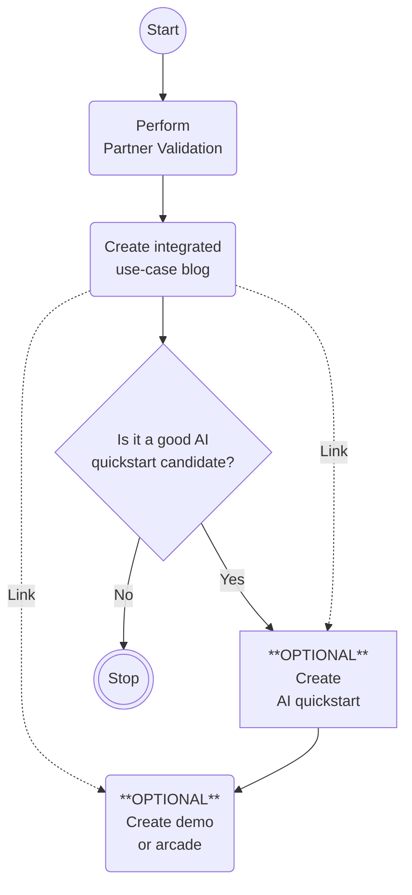

# homelab

```mermaid
flowchart TD
    S@{ shape: circ, label: "Start" } -->A("Perform\nPartner Validation")
    A -->B("Create integrated\nuse-case blog")
    B -->C{"Is it a good AI\nquickstart candidate?"}
    B -.->|Link| F
    C -->|Yes| D["**OPTIONAL**\nCreate\nAI quickstart"]
    B -.->|Link| D
    C -->|No| E@{ shape: dbl-circ, label: "Stop" }
    D -->F("**OPTIONAL**\nCreate demo\nor arcade")
```
