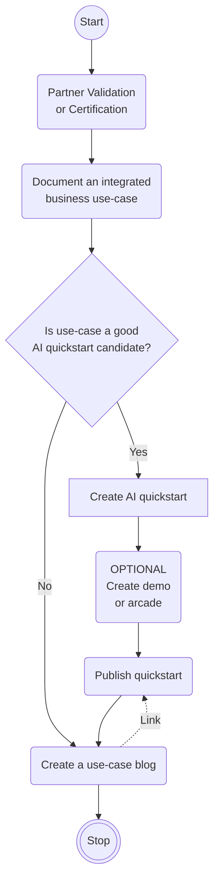

# homelab

```mermaid
flowchart TD
    S@{ shape: circ, label: "Start" } -->A("Partner Validation\nor Certification")
    A -->B("Document an integrated\nbusiness use-case ")
    B -->C{"Is use-case a good\nAI quickstart candidate?"}
    C -->|Yes| D["Create AI quickstart"]
    C -->|No| E("Create a use-case blog")
    E -.->|Link| H
    D -->F("OPTIONAL\nCreate demo\nor arcade")
    F -->H("Publish quickstart")
    H -->E
    E -->G@{ shape: dbl-circ, label: "Stop" }
```
