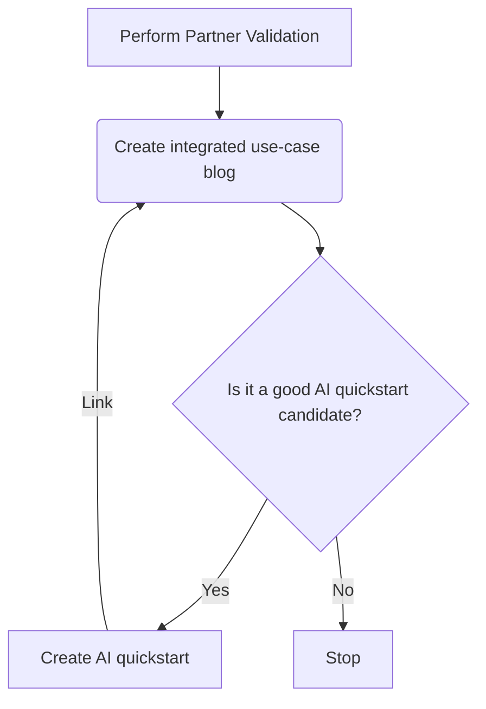

# homelab

```mermaid
flowchart TD
    A[Perform Partner Validation] -->B(Create integrated use-case blog)
    B --> C{Is it a good AI quickstart candidate?}
    C -->|Yes| D[Create AI quickstart]
    C -->|No| E[Stop]
    D -->|Link| B
```
