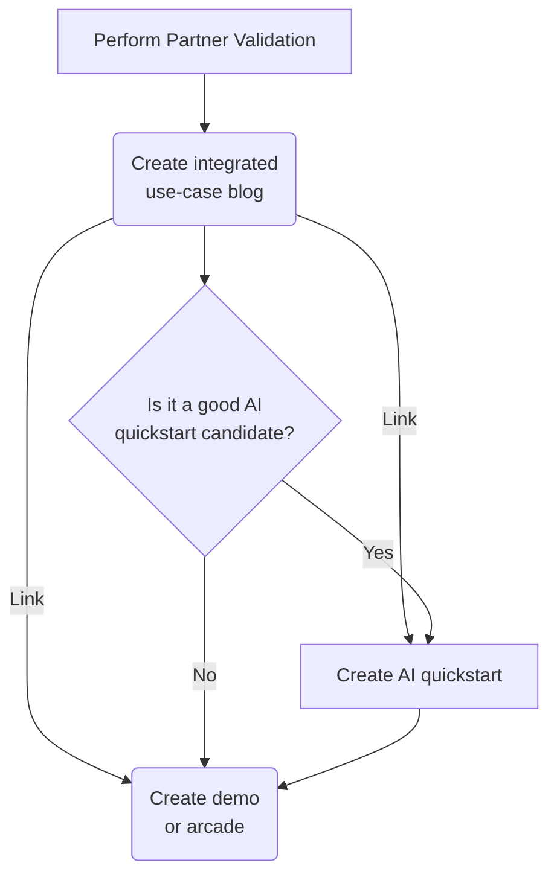

# homelab

```mermaid
flowchart TD
    A[Perform Partner Validation] -->B("Create integrated\nuse-case blog")
    B --> C{"Is it a good AI\nquickstart candidate?"}
    B -->|Link| D
    B -->|Link| E
    C -->|Yes| D[Create AI quickstart]
    C -->|No| E[Stop]
    D --> E("Create demo\nor arcade")
```
