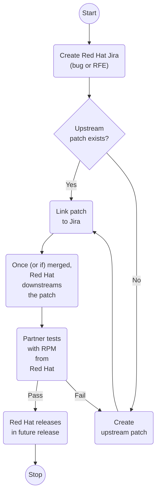

# homelab

```mermaid
flowchart TD
    Start@{ shape: circle, label: "Start" } --> jira("Create Red Hat Jira\n(bug or RFE)")
    jira --> patch{"Upstream\npatch exists?"}
    patch -->|Yes|link("Link patch\nto Jira")
    patch -->|No|create-patch("Create\nupstream patch")
    create-patch -->link
    link --> downstream("Once (or if) merged,\nRed Hat\ndownstreams\nthe patch")
    downstream --> test("Partner tests\nwith RPM\nfrom\nRed Hat")
    test -->|Pass|release("Red Hat releases\nin future release")
    release -->Stop@{ shape: circle, label: "Stop" }
    test -->|Fail|create-patch
```
