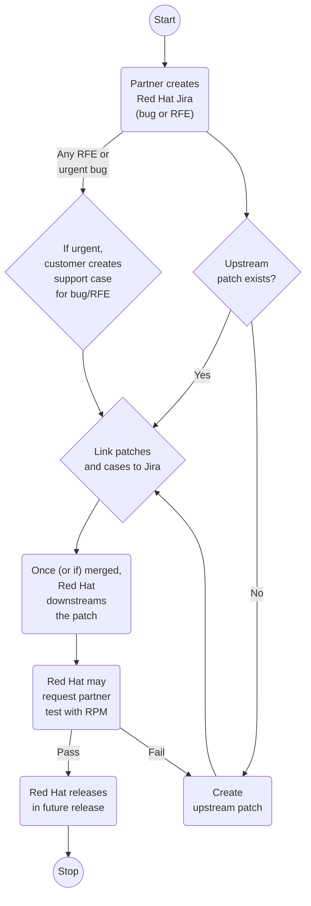

# OpenStack bug/RFE workflow

```mermaid
flowchart TD
    Start@{ shape: circle, label: "Start" } --> jira("Partner creates\nRed Hat Jira\n(bug or RFE)")
    jira -->|"Any RFE or\nurgent bug"| case{"If urgent,\ncustomer creates\nsupport case\n for bug/RFE"}
    jira --> patch{"Upstream\npatch exists?"}
    case --> link{"Link patches \nand cases to Jira"}
    patch -->|Yes|link
    patch -->|No|create-patch("Create\nupstream patch")
    create-patch -->link
    link --> downstream("Once (or if) merged,\nRed Hat\ndownstreams\nthe patch")
    downstream --> test("Red Hat may\nrequest partner\ntest with RPM")
    test -->|Pass|release("Red Hat releases\nin future release")
    release -->Stop@{ shape: circle, label: "Stop" }
    test -->|Fail|create-patch
```
