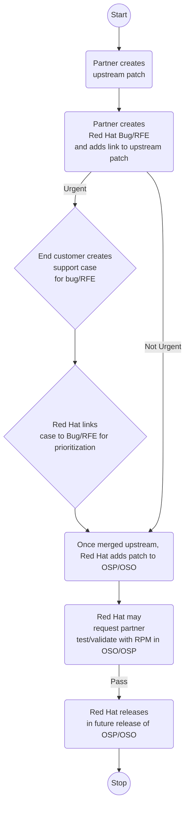

# OpenStack bug/RFE workflow

```mermaid
flowchart TD
    Start@{ shape: circle, label: "Start" } --> create-patch("Partner creates\nupstream patch")
    create-patch --> jira("Partner creates\nRed Hat Bug/RFE\nand adds link to upstream patch")
    jira --> |Urgent|case{"End customer creates\nsupport case\n for bug/RFE"}
    case --> link{"Red Hat links\ncase to Bug/RFE for prioritization"}
    link --> downstream("Once merged upstream, \nRed Hat adds patch to OSP/OSO")
    jira --> |Not Urgent|downstream
    downstream --> test("Red Hat may\nrequest partner\ntest/validate with RPM in OSO/OSP")
    test -->|Pass|release("Red Hat releases\nin future release of OSP/OSO")
    release -->Stop@{ shape: circle, label: "Stop" }
```
